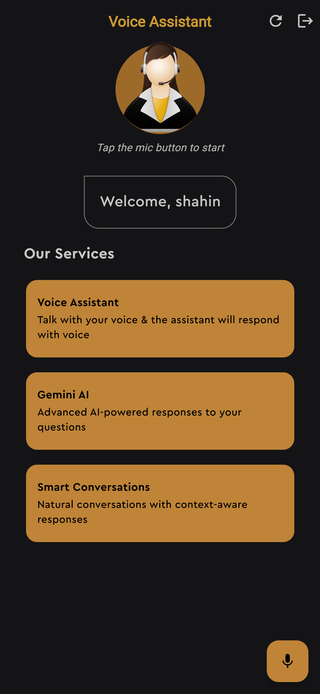
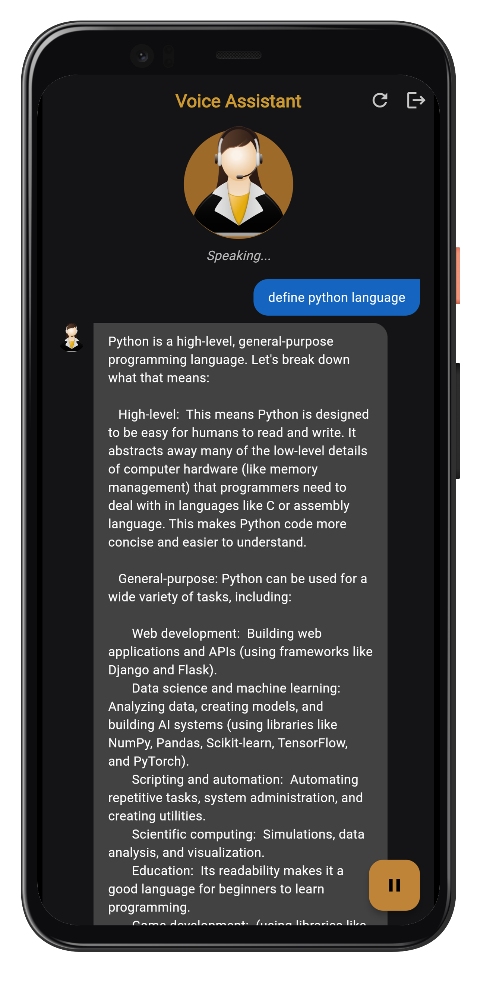

## Overview

The Professional Voice Assistant is a modern, cross-platform application that transforms how users interact with AI technology. Built with Flutter, this application works seamlessly across iOS, Android, and web platforms, providing a consistent and intuitive experience wherever your clients need it.

## Problem Solution

In today's fast-paced digital environment, traditional text-based interfaces can be cumbersome and inaccessible for many users. Our Professional Voice Assistant solves these challenges by:

- **Eliminating typing barriers** - Perfect for users on-the-go or those with accessibility needs
- **Providing natural conversation flow** - Creates a more human-like interaction experience
- **Offering hands-free operation** - Ideal for multitasking or situations where typing is impractical
- **Reducing the learning curve** - Voice is the most intuitive way for humans to communicate

## Key Features & Capabilities

### Intelligent Voice Recognition
- Advanced speech-to-text technology captures user queries with high accuracy
- Adapts to different accents and speaking patterns
- Provides real-time visual feedback of recognized speech

### AI-Powered Responses
- Integration with Google's Gemini AI delivers intelligent, context-aware answers
- Handles complex queries with natural language processing
- Maintains conversation history for contextual understanding

### Seamless Voice Output
- Natural-sounding text-to-speech capabilities
- Adjustable speaking rate for user preference
- Speaking can be paused and resumed as needed

### Secure User Authentication
- Personalized user experience with secure account creation
- Email/password authentication with Firebase
- Strong password requirements and validation
- Profile management with personal information storage

## User Experience Flow

### Account Setup
1. **Sign Up** - New users create an account with email and password
2. **Sign In** - Returning users access their personal assistant profile
3. **Personalization** - The assistant greets users by name and remembers preferences

### Voice Interaction
1. **Activation** - Users tap the microphone button to begin speaking
2. **Query Processing** - The assistant listens, processes, and generates a response
3. **Voice Response** - The answer is delivered via natural-sounding speech
4. **Continuous Conversation** - Users can ask follow-up questions while maintaining context

## User Interface

<table>
  <tr>
    <td>
      
      
Login Screen

    </td>
    <td>
      
      
Signup Screen

    </td>
  </tr>
  <tr>
    <td>
      
      
Home Screen

    </td>
    <td>
      
      
Conversation Screen

    </td>
  </tr>
</table>

## Benefits for End-Users

- **Efficiency** - Get answers and complete tasks faster than traditional interfaces
- **Accessibility** - Makes technology more available to all users regardless of typing ability
- **Learning Support** - Provides instant answers to questions without complex navigation
- **Multitasking** - Allows users to get information while engaged in other activities
- **Modern Experience** - Delivers the cutting-edge AI experience users expect in today's market

## Technical Excellence

While built on sophisticated technology, the Professional Voice Assistant presents a seamless experience that hides complexity from end-users. The application leverages state-of-the-art speech recognition, AI processing, and voice synthesis to create natural interactions that feel magical rather than technical.

---

*Professional Voice Assistant - Bringing the future of AI interaction to your fingertips*
